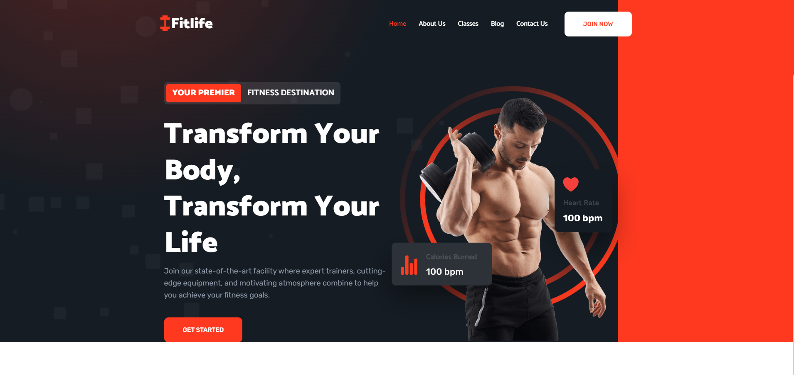

<div align="center">
  <h2 align="center">FitLife - Your Ultimate Fitness Companion 💪</h2>
  <p>A modern, fully responsive fitness website designed to inspire your wellness journey. Built with clean code and smooth animations.</p>
  <br />
</div>

### 🌟 Features

- **Responsive Design**: Perfectly adapts to all devices and screen sizes
- **Modern UI/UX**: Clean and intuitive interface with smooth animations
- **Performance Optimized**: Fast loading with optimized assets
- **Cross-browser Compatible**: Works seamlessly across all modern browsers

### 🖼️ Preview



### 🗂️ Project Structure

```
FitLife/
├── assets/
│   ├── css/
│   │   └── style.css
│   ├── images/
│   │   ├── about-banner.png
│   │   ├── hero-banner.png
│   │   └── [other image assets...]
│   └── js/
│       └── script.js
├── favicon.svg
├── index.html
└── README.md
```

### 🛠️ Tech Stack

- **HTML5**
  - Semantic markup
  - SEO optimized structure

- **CSS3**
  - Custom properties
  - Flexbox & Grid
  - Media queries for responsiveness
  - Smooth animations

- **JavaScript**
  - Dynamic content loading
  - Interactive UI elements
  - Smooth scrolling


### 💡 Development

To modify the website:

1. Edit HTML files for structure changes
2. Modify `assets/css/style.css` for styling
3. Update `assets/js/script.js` for functionality

### 🤝 Contributing

Contributions are welcome! Feel free to:
- Fork the repository
- Create a feature branch
- Submit a pull request

---

<div align="center">

If you find this project helpful, please consider giving it a ⭐ star. It helps us reach more fitness enthusiasts!

Made with ❤️ for fitness enthusiasts
</div>
